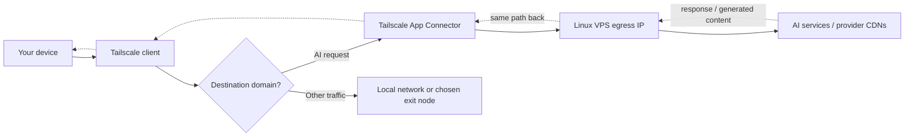

# Tailscale AI Egress Connector

Languages: English | [繁體中文（香港）](README.zh-HK.md)

[](https://github.com/F-e-u-e-r/tailscale-ai-egress/actions/workflows/ci.yml)
[](LICENSE)


A small bootstrap toolkit for creating a personal Tailscale App Connector that routes selected AI-related domains through a chosen VPS egress IP, while keeping normal traffic on the user's local network or preferred exit node.

> **Stable v1.x.** The 1.0 command surface is frozen — see [docs/Stability.md](docs/Stability.md); v1.1 adds opt-in failover and health-monitoring helpers (`failover-exit-node.sh`, `monitor-connectors.sh`) without changing it. Every entrypoint supports `--version` and `--help`. Licensed under [MIT](LICENSE). New here? Jump to [Which Mode Should I Use?](#which-mode-should-i-use) and the [Quick Start](#quick-start).

## Default Path

If you just want the recommended setup on a fresh VPS:

```bash
git clone https://github.com/F-e-u-e-r/tailscale-ai-egress.git
cd tailscale-ai-egress
./bootstrap.sh
```

Choose the default `common` domains, answer `N` to Advanced Mode, paste the generated policy snippet, then finish the Tailscale node login.

## Features

- **🎯 Domain-selective AI egress** — route only the AI domains you choose through a VPS exit IP; everything else stays on your local network or preferred exit node.
- **🔁 Same-region connector failover** — run two or more App Connectors under one tag so new AI-domain connections move to a healthy connector if one goes offline.
- **🛟 Exit-node failover controller** — `failover-exit-node.sh --watch --apply` promotes a backup exit node when the primary fails its health check, with hysteresis, cooldown, and an optional post-switch notify hook.
- **📊 Connector HA monitoring + metrics** — `monitor-connectors.sh` reports each connector's online / reachability / route state plus per-connector metrics (Tx/Rx counters, liveness, `tailscale ping` latency, connection path). Emit a node_exporter / Prometheus textfile with `--prometheus-textfile`, or read one connector with `health_check.py peer-metrics`.
- **🧭 Guided setup, opt-in automation** — a manual policy snippet by default; opt in to auditable API-driven policy (`plan` → `apply-plan`) only when you choose, never automatically.
- **🩺 Diagnostics, JSON-ready** — `diagnose.sh` (VPS) and `check-client-routes.sh` (client) verify routing end to end; both support `--json` for scripting.
- **🔒 Security-first** — no telemetry; secrets only from env / hidden input; release-artifact checksum plus optional `gh` build-provenance attestation verification; auditable policy plans with `If-Match` concurrency checks; and a health engine hardened to fail closed on malformed status.

## Contents

- [Features](#features)
- [Before You Start](#before-you-start)
- [Which Mode Should I Use?](#which-mode-should-i-use)
- [Quick Start](#quick-start)
- [Manual Guided Mode](#manual-guided-mode)
- [Advanced Policy Automation](#advanced-policy-automation)
- [Domains](#domains)
- [Diagnostics](#diagnostics)
- [Exit-Node Fallback](#exit-node-fallback)
- [Rollback](#rollback)
- [Removal And Cleanup](#removal-and-cleanup)
- [Configuration](#configuration)
- [Security Notes](#security-notes)
- [Documentation](#documentation)

## Before You Start

You need:

- A Tailscale account and a tailnet you can administer.
- A fresh Linux VPS, such as Ubuntu, Debian, Fedora, CentOS, or Alpine.
- SSH access to that VPS.
- Permission to edit the Tailscale Admin Console policy, or a Tailscale API/OAuth credential for policy automation.

## Which Mode Should I Use?

Use this when you want a predictable VPS egress IP for selected AI services without sending all of your internet traffic through that VPS — for example, testing service behavior from a specific region, or keeping AI tools on a known egress IP while banking, local services, and region-sensitive sites stay on your normal network. This is not a standalone VPN or proxy: it assumes you already use, or are willing to use, Tailscale, and you remain responsible for AI provider, Tailscale, VPS, and local network policies.



Most people should start with the **App Connector default** and never change it.

| If you want to... | Use | How |
| --- | --- | --- |
| Route only selected AI domains through one VPS (the default) | **App Connector** | `./bootstrap.sh`, then paste the generated snippet (Manual Guided Mode) |
| Keep AI egress working if one VPS goes down, in the same region | **Same-region connector failover** | Bootstrap a second VPS with the same `CONNECTOR_TAG`; see [docs/Failover.md](docs/Failover.md) |
| Temporarily send all traffic through the VPS (emergency only) | **Exit-node fallback** | `./enable-exit-node.sh`; stop later with `./disable-exit-node.sh` |
| Automatically fail an exit node over to a backup when the primary goes down | **Exit-node failover (v1.1)** | `./failover-exit-node.sh --watch --apply`; see [docs/Failover.md](docs/Failover.md) |
| Monitor a primary/fallback connector pair (online + reachability) | **Connector HA monitor (v1.1)** | `./monitor-connectors.sh --once`; see [docs/Failover.md](docs/Failover.md) |
| Have the installer edit your tailnet policy through the API instead of pasting | **Advanced Admin Automation** | Opt in at the Advanced Mode prompt, or run `policy_tool.py plan` then `apply-plan` |

Manual Guided Mode is the recommended path for policy setup. Advanced Admin Automation is opt-in only and always defaults to "no", even when API credentials are already present. See [docs/Stability.md](docs/Stability.md) for what is frozen in the 1.x series.

The repo uses three explicit modes:

| Mode | Meaning |
| --- | --- |
| `connector` | Default mode. Only configured AI domains should use the VPS path. |
| `exit-node fallback` | Intentional full-traffic mode for an already-bootstrapped connector host. Use sparingly on cloud VPS plans because all selected-client internet traffic can consume VPS transfer. |
| `same-region connector failover` | Two or more App Connector VPS nodes share the same connector tag so new matching AI-domain connections can move to another online connector. |

An App Connector is domain-selective routing through a tagged Tailscale device; an exit node routes *all* internet traffic. See Tailscale's docs for [App Connectors](https://tailscale.com/docs/features/app-connectors) and [Exit Nodes](https://tailscale.com/docs/features/exit-nodes).

<details>
<summary>How this compares to other approaches (VPN, SOCKS, WARP…)</summary>

| Approach | Choose It When | Avoid It When |
| --- | --- | --- |
| This project | You already use Tailscale and want only selected AI-related domains through a VPS | You need a standalone proxy/VPN without Tailscale |
| Full Tailscale exit node | You want every app to use the same remote egress IP | You only want AI services routed and want to save VPS transfer |
| WireGuard/OpenVPN | You want a traditional full VPN stack independent of Tailscale | You do not want to manage a separate VPN client/config |
| SOCKS/HTTP proxy | One app or browser profile can be configured to use a proxy cleanly | You need transparent system-level domain routing |
| SSH tunnel / port forwarding | You only need a quick browser-level SOCKS route through one server | You want automatic routing across devices without changing browser proxy settings |
| Cloudflare WARP or similar | You want a managed consumer VPN-like path | You need egress from your own VPS IP |

Cost and latency depend on your VPS region, bandwidth allowance, and Tailscale plan. Light connector-only use often fits an entry-level VPS transfer allowance, while exit-node fallback can consume tens or hundreds of GB quickly because every selected-client connection uses the VPS. Expect extra latency roughly equal to your device-to-VPS path plus the VPS-to-AI-service path; interactive chat feels this most on first-token latency and uploads, so test with your own VPS first. Check [Tailscale pricing](https://tailscale.com/pricing) before using it in a team or production tailnet.
</details>

<details>
<summary>Tailscale terms used here</summary>

| Term | Plain Meaning |
| --- | --- |
| tailnet | Your private Tailscale network |
| App Connector | A Tailscale device that routes traffic for configured app domains |
| exit node | A Tailscale device that can route all internet traffic |
| auth key | A `tskey-auth-...` key used to register a new device into your tailnet; this is different from a `tskey-api-...` API token |
| tailnet policy | Tailscale's access-control and routing policy file |
| HuJSON | Human JSON, a JSON-like format Tailscale uses for policy files that can include comments and trailing commas |
| tag | A label that owns infrastructure devices, such as `tag:ai-egress-us` |
| `autogroup:member` | Tailscale's built-in group for tailnet members |
| `autogroup:internet` | Tailscale's policy destination for internet egress |
</details>

## What This Automates

- Installs Tailscale and basic diagnostics tools on a fresh VPS.
- Enables IPv4 and IPv6 forwarding for connector routing.
- Configures the VPS as a Tailscale App Connector.
- Lets the user use the common domain list, or enter custom domains.
- Generates a policy snippet and guides the user through the Tailscale Admin Console by default.
- In explicit Advanced Mode only, can back up, merge, validate, and apply the tailnet policy through the Tailscale API.
- Provides separate helper scripts for intentional exit-node fallback after the connector is already working.

## Quick Start

On a fresh Linux VPS (Ubuntu, Debian, Fedora, CentOS, or Alpine), clone the published repo. This README assumes the repo is published at `F-e-u-e-r/tailscale-ai-egress`:

> **Alpine:** run `apk add bash git` first — the scripts are Bash and Alpine ships only BusyBox `ash`.

```bash
git clone https://github.com/F-e-u-e-r/tailscale-ai-egress.git
cd tailscale-ai-egress
./bootstrap.sh
```

The installer asks:

```text
Detected region: jp
Region [jp]:
Hostname keyword, 3-5 chars (Enter for 01):
Which domains?
  common - ChatGPT, Claude, Poe, OpenRouter, Perplexity (default)
  custom - enter domains manually
Domains [common]:
Advanced Mode can update your Tailscale policy automatically.
Most users should paste the generated snippet manually.
Do you want this installer to update your Tailscale policy automatically? This is Advanced Mode. [y/N]
Tailscale node auth key, tskey-auth-* (leave blank for browser login):
```

When `REGION` is unset, interactive bootstrap detects the VPS country code from
its public IP and lets you confirm or override it. Press Enter at the hostname
keyword prompt to use `ai-egress-<region>-01`; enter a 3-5 character keyword to
use `ai-egress-<region>-<keyword>`. The keyword changes only the device
hostname, not the connector name or tag.

For the auth key prompt, use a `tskey-auth-...` key — not a `tskey-api-...` token. Recommended key settings (reusable, expiration, tags, pre-approval) are in [docs/Configuration.md](docs/Configuration.md#recommended-auth-key-settings).

## What Success Looks Like

A successful run ends with:

```text
== VPS-side diagnostics ==
[OK] ...

Done
If diagnostics show AI domains routing through Tailscale, the connector is ready.
App Connector DNS discovery and route advertisement can take 1-2 minutes.
On your client device, clone this repo or download check-client-routes.sh, then run:
  ./check-client-routes.sh
```

From a client device in the same tailnet, run:

```bash
git clone https://github.com/F-e-u-e-r/tailscale-ai-egress.git
cd tailscale-ai-egress
./check-client-routes.sh
```

Or download only the client checker:

```bash
curl -fsSLO https://raw.githubusercontent.com/F-e-u-e-r/tailscale-ai-egress/main/check-client-routes.sh
chmod +x check-client-routes.sh
./check-client-routes.sh
```

AI domain routes should point to Tailscale. Ordinary public IP checks may still show your local ISP because App Connector mode only routes matching domains. If the first check warns or fails right after setup, wait 1-2 minutes for DNS discovery and route advertisement, then run the client check again.

## Manual Guided Mode

Manual Guided Mode is the recommended path. The installer creates:

```text
generated/app-connector.snippet.json
```

Then open:

```text
https://login.tailscale.com/admin/acls/file
```

Merge the generated snippet into your tailnet policy, save it, and return to the installer.

Treat `generated/` as sensitive from this point onward. It can contain domain choices, policy snippets, policy plans, and full tailnet policy backups.

Before pasting, you can validate the connector config locally:

```bash
python3 scripts/policy_tool.py validate \
  --domains-file policy/default-ai-domains.json
```

## Advanced Policy Automation

If you explicitly opt in, the installer can update the Admin Console policy for you. The prompt always defaults to `N`, even when credentials already exist. Use this only after reviewing the generated change — Advanced Mode adds broad app-connector egress grants and route auto-approvers for the connector tag.

The recommended flow generates an auditable bundle, then applies that exact bundle after you review it:

```bash
# Fetch current policy, validate, and write a bundle under generated/policy-plans/.
python3 scripts/policy_tool.py plan --tailnet - \
  --domains-file policy/default-ai-domains.json

# Inspect plan.<plan-id>/diff.patch and manifest.json, then apply that bundle.
python3 scripts/policy_tool.py apply-plan generated/policy-plans/plan.<plan-id>
python3 scripts/policy_tool.py list-plans
```

To opt in through the installer instead, export `TAILSCALE_API_KEY` (or the `TAILSCALE_OAUTH_CLIENT_ID` / `TAILSCALE_OAUTH_CLIENT_SECRET` pair) and `TAILSCALE_TAILNET`, then run `./bootstrap.sh` and answer `y` at the Advanced Mode prompt. The older `policy_tool.py apply` command is deprecated in favor of `plan` plus `apply-plan`. If the credential is missing, planning fails, or you decline the exact apply confirmation, the installer falls back to guided manual mode.

Full details — local preview/merge flows (`validate`, `merge --diff`) and the plan bundle contents (`current.hujson`, `merged.json`, `diff.patch`, `manifest.json`): [docs/Tailscale-API-mode.md](docs/Tailscale-API-mode.md).

## Domains

The installer uses one built-in `common` domain list by default. Choose
`custom` in the interactive wizard, or pass `--domains-file`, when you want to
manage the domains manually.

| Pack | File | Domains |
| --- | --- | --- |
| `common` | [policy/default-ai-domains.json](policy/default-ai-domains.json) | ChatGPT, Claude, Poe, OpenRouter, Perplexity, NotebookLM |

You can select the built-in list non-interactively:

```bash
./bootstrap.sh --domain-pack common
```

Or pass a custom file:

```bash
./bootstrap.sh --domains-file /path/to/domains.txt
```

Resolution order is: `--domain-pack common` XOR `--domains-file`, then `AI_EGRESS_DOMAINS_FILE`, then the interactive wizard, then `common`.

The `common` list contains:

```text
chatgpt.com, openai.com, claude.ai, anthropic.com,
poe.com, openrouter.ai, perplexity.ai, notebooklm.google.com
```

Most base domains also include their wildcard form, such as `*.chatgpt.com`.
NotebookLM is included as the exact domain `notebooklm.google.com`; broad Google
wildcards are intentionally not included.

The built-in packs intentionally avoid broad infrastructure or identity domains like `google.com`, `microsoft.com`, `cloudflare.com`, and generic CDN domains to reduce over-routing. Add provider-specific app, API, or asset domains manually only if your use case needs them.

Two guardrails apply when you add domains: broad CDN / shared-infrastructure domains such as `cloudfront.net`, `amazonaws.com`, `fastly.net`, `akamaihd.net`, `azureedge.net`, and `googleusercontent.com` **validate with a warning** (they can pull unrelated traffic that shares the CDN through the connector), while the very broadest wildcards (`*.com`, `*.google.com`, `*.microsoft.com`, `*.cloudflare.com`, `*.googleapis.com`) are **blocked** unless you pass `--allow-broad-wildcard`.

Gemini and Microsoft Copilot domains are not in the default list because they can involve broad Google or Microsoft identity, app, and CDN infrastructure. Add those domains manually only after testing the routing impact for your tailnet.

## Diagnostics

Run VPS-side diagnostics on the connector host:

```bash
./diagnose.sh
```

It checks:

- Public IPv4/IPv6 egress.
- ASN, when available.
- IP forwarding sysctls.
- Tailscale status, connector tag visibility, and exit-node advertising state.
- Sample DNS resolution and route lookup for configured domains.

Run client-side route verification on your Mac or Linux client:

```bash
./check-client-routes.sh
```

It checks every IPv4 A record for the selected AI domains and reports whether they route through the Tailscale App Connector path. When a domain also publishes IPv6 (AAAA) records, it inspects those too as an **advisory** check (separate `*-ipv6` check ids); IPv6 findings are informational and never fail the run, and a domain with no AAAA is skipped cleanly. It also checks a baseline domain, `ipinfo.io`, to confirm ordinary traffic stays local in connector-only mode. If you intentionally use an exit node, baseline traffic through the selected exit node is expected because that is full-traffic mode.

Both diagnostic scripts use `[OK]`, `[WARN]`, and `[FAIL]`. Any `[FAIL]` exits with status `1`; warnings alone exit `0` and print a summary to stderr. For scripted support, both scripts also support `--json`; JSON output includes `schema_version: 1`, `script`, `summary`, and `checks`.

`diagnose.sh` currently recognizes App Connector mode by the project tag convention `tag:ai-egress-*`. Custom connector tags can still work, but this diagnostic check will report them as unknown until custom-tag detection is added.

## Exit-Node Fallback

App Connector mode should be your normal mode. If you need an emergency full-traffic fallback on an already-bootstrapped Linux connector host, use:

```bash
./enable-exit-node.sh
```

This advertises the same VPS as a Tailscale exit node after an explicit transfer warning. You may still need to approve the exit node in the Tailscale Admin Console, then select it from each client. Do not use a cloud VPS as an always-on full exit node unless you understand your provider's transfer allowance and overage model.

Monitor transfer when exit-node fallback is enabled. At minimum, check your VPS provider's bandwidth graph or quota alerts during the first session, and set provider-level billing/quota alerts before leaving a cloud VPS available as an exit node.

To stop advertising exit-node capability:

```bash
./disable-exit-node.sh
```

If connector settings were changed while troubleshooting, restore the intended connector mode:

```bash
./restore-connector.sh
```

The default restore path is conservative and does not reset hostname, tags, DNS, route acceptance, or other local Tailscale preferences. If the local Tailscale client cannot restore App Connector advertising with `tailscale set`, run the explicit repair path:

```bash
./restore-connector.sh --force-reset
```

`--force-reset` runs `tailscale up --reset` with the full connector flags and can clear local preferences such as `accept-routes`, `accept-dns`, and manually added flags.
It refuses to run unless it can identify one coherent tag-and-hostname pair.
Partial explicit identity, stale persisted identity, and multiple matching
`tag:ai-egress-*` status tags fail before reset. See
[docs/Configuration.md](docs/Configuration.md) for source precedence.

## Multi-Machine Failover

For same-region connector failover, you can run two connectors, such as AWS Lightsail plus WebARENA in Japan, under the same connector tag (`tag:ai-egress-jp`). This lets Tailscale move new matching AI-domain connections to another online connector after it detects one connector is unavailable. Use different tags, such as `tag:ai-egress-jp` and `tag:ai-egress-us`, for cross-region egress to avoid unexpected latency or region switching.

Detailed setup and verification: [docs/Failover.md](docs/Failover.md). Provider notes: [AWS Lightsail](docs/AWS-Lightsail.md) · [WebARENA](docs/WebARENA.md) · [Generic VPS](docs/Generic-VPS.md) · [Home Mac exit node](docs/Home-Mac-Exit-Node.md).

## Rollback

Advanced Mode stores policy plans in `generated/policy-plans/`. To inspect and restore an applied plan:

```bash
python3 scripts/policy_tool.py list-plans
python3 scripts/policy_tool.py restore-plan generated/policy-plans/plan.<plan-id>
```

`restore-plan` validates `current.hujson`, fetches a fresh `ETag`, asks for `RESTORE <plan-id>`, then restores the captured pre-apply policy. During `./bootstrap.sh`, if Advanced Mode applies a plan but `tailscale up` then fails, the installer automatically attempts `restore-plan` for that bundle before exiting.

Legacy direct `apply` saves timestamped backups in `generated/`; `rollback.sh` restores those:

```bash
./rollback.sh            # restore the latest backup
./rollback.sh --list     # list available backups
./rollback.sh generated/tailnet-policy.backup.<timestamp>.hujson
```

With API credentials, `rollback.sh` prints the selected backup path and confirms before replacing the current policy (set `ROLLBACK_ACK=1` intentionally in automation). Without API credentials, it prints the latest backup path and the Admin Console URL so you can paste it manually.

## Removal And Cleanup

To temporarily take the connector offline without uninstalling:

```bash
sudo systemctl stop tailscaled      # systemd
sudo rc-service tailscale stop      # Alpine/OpenRC
```

For full removal, follow the complete ordered guide in
**[docs/Uninstall.md](docs/Uninstall.md)**. It covers disabling exit-node
fallback, rolling back any Advanced Mode policy changes, logging the node out,
removing the forwarding sysctl drop-in, and Admin Console cleanup (device
record, keys, and the connector's policy entries).

## Configuration

Most runs need no environment variables — the wizard handles everything. For non-interactive or automation use, the common ones are:

```bash
REGION=us                          # skip interactive region detection
DRY_RUN=1                          # print actions without changing the system
CONNECTOR_TAG=tag:ai-egress-us     # override the derived connector tag
TAILSCALE_AUTHKEY=tskey-auth-...   # node auth key for non-interactive login
AI_EGRESS_DOMAINS_FILE=/path/to/domains.txt
```

`REGION` changes the derived connector name, tag, and default hostname region; the optional hostname keyword changes only a single device hostname, so same-region failover nodes can still share one connector tag. The full list of variables — API/OAuth, timeouts, and automation acknowledgements — is in **[docs/Configuration.md](docs/Configuration.md)**.

## Security Notes

See [SECURITY.md](SECURITY.md) for the full security model. Highlights:

- Auth keys and API tokens are read from environment variables or hidden terminal input and are never written to repo files or logs. Use `tskey-api-...` only for Admin Console policy updates and `tskey-auth-...` only for registering the VPS node.
- `tailscale up` uses `--auth-key=file:...` so keys never appear in shell history. Non-interactive runs must set `TAILSCALE_AUTHKEY`, or the installer exits instead of waiting for browser login.
- `install.sh` verifies downloaded release artifacts against the release `SHA256SUMS` by default. When [GitHub CLI](https://cli.github.com/) `gh` (>= 2.93.0) is present it additionally verifies the release tarball's **build provenance attestation**, narrowed to this repo's release workflow on the exact tag; a missing, older, or unrecognized `gh` degrades to checksum-only (never failing), while an attestation that a usable `gh` actively rejects is fatal. Set `TAILSCALE_AI_EGRESS_SKIP_ATTESTATION=1` to opt out (e.g. offline installs or a non-GitHub mirror) — the checksum still runs, but publisher provenance is no longer verified. `bootstrap.sh` will not pass `tailscale up --reset` on a fresh node without asking first.
- Advanced Mode writes an auditable plan (with the original `current.hujson` and SHA-256 checks) before applying, and `apply-plan` uses the planning `ETag` with `If-Match` to detect concurrent edits instead of overwriting them silently.
- The generated policy grants `autogroup:member` access to `autogroup:internet` and auto-approves `0.0.0.0/0` and `::/0` for the connector tag — required for broad app-connector egress, but it widens a restrictive tailnet policy, so protect ownership of `tag:ai-egress-*`.
- Manual mode needs no Tailscale API credential. This project collects no telemetry and sends no logs to project-owned servers.

## Known Limitations

- Tailscale App Connectors are domain-triggered but route by resolved IP. If a domain resolves to a shared CDN IP, related traffic on that IP may also route through the connector.
- Advanced Mode normalizes the applied merged policy to formatted JSON. The plan bundle preserves the original `current.hujson` for review and restore, but comments may not be preserved in the applied version.
- IPv6 routing depends on your VPS provider and Tailscale/client settings.
- This is designed for fresh Linux VPS hosts. `bootstrap.sh` checks for existing local Tailscale state before using `--reset`, but you should still be careful on machines with custom Tailscale setups.

## Documentation

- [docs/Stability.md](docs/Stability.md) — what is frozen in 1.x and the support policy.
- [docs/Roadmap.md](docs/Roadmap.md) — non-binding planned direction for 1.2+ and 2.0.
- [docs/Configuration.md](docs/Configuration.md) — environment variables and recommended auth-key settings.
- [docs/Tailscale-API-mode.md](docs/Tailscale-API-mode.md) — Advanced policy automation in depth.
- [docs/Failover.md](docs/Failover.md) — same-region connector failover.
- [docs/Troubleshooting.md](docs/Troubleshooting.md) — common issues and route caveats.
- [docs/Uninstall.md](docs/Uninstall.md) — complete removal and cleanup.
- Provider notes: [AWS Lightsail](docs/AWS-Lightsail.md) · [WebARENA](docs/WebARENA.md) · [Generic VPS](docs/Generic-VPS.md) · [Home Mac exit node](docs/Home-Mac-Exit-Node.md).
- Project: [CHANGELOG](CHANGELOG.md) · [SECURITY](SECURITY.md) · [PRIVACY](PRIVACY.md) · [SUPPORT](SUPPORT.md) · [CONTRIBUTING](CONTRIBUTING.md) · [LICENSE](LICENSE).
- Release process: [docs/Release-Checklist.md](docs/Release-Checklist.md) · [docs/Validation-Matrix.md](docs/Validation-Matrix.md).

**Forking:** the published commands use `F-e-u-e-r/tailscale-ai-egress`. If you fork or rename the repo, update `README.md`, `docs/`, and `install.sh` together.
