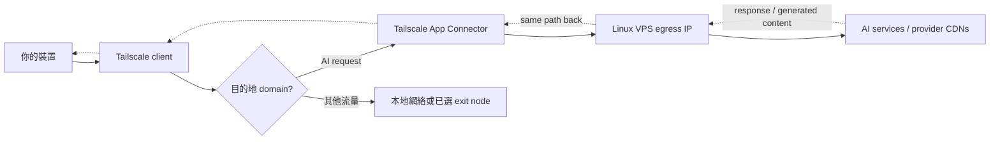

# Tailscale AI Egress Connector

語言：[English](README.md) | 繁體中文（香港）

[](https://github.com/F-e-u-e-r/tailscale-ai-egress/actions/workflows/ci.yml)
[](LICENSE)


> `README.md` 是最新內容的主要來源。本中文文件使用香港繁體中文；台灣讀者可能會見到少量用語差異，例如「網絡」和「網路」。

> **Stable v1.x.** 1.0 的 command surface 已凍結，詳見 [docs/Stability.md](docs/Stability.md)；v1.1 新增 opt-in failover 與 health-monitoring helpers（`failover-exit-node.sh`、`monitor-connectors.sh`），不會改變原有 command surface。所有 entrypoint 都支援 `--version` 和 `--help`。

這個 repo 會幫你建立一台個人用 Tailscale App Connector，將指定 AI 相關 domains 經一台 VPS 的固定出口 IP 連出去，同時讓一般網絡流量繼續使用本地網絡或你慣用的 exit node。

## 預設路徑

如果你只想用建議設定，在全新 VPS 執行：

```bash
git clone https://github.com/F-e-u-e-r/tailscale-ai-egress.git
cd tailscale-ai-egress
./bootstrap.sh
```

選預設 `common` domains，Advanced Mode 回答 `N`，貼上產生的 policy snippet，然後完成 Tailscale node login。

## 功能

- **🎯 Domain-selective AI egress** — 只把你選的 AI domains 經 VPS 出口 IP，其他流量繼續走本地網絡或你慣用的 exit node。
- **🔁 同區 connector failover** — 多台 App Connector 共用同一 tag，其中一台離線時，新的 AI-domain 連線會轉去仍在線的 connector。
- **🛟 Exit-node failover controller** — `failover-exit-node.sh --watch --apply` 在主 exit node 健康檢查失敗時切換到備援，具備 hysteresis、cooldown 和可選的 post-switch notify hook。
- **📊 Connector HA 監察 + metrics** — `monitor-connectors.sh` 報告每台 connector 的 online／可達性／route 狀態，以及 per-connector metrics（Tx/Rx counters、liveness、`tailscale ping` latency、connection path）。用 `--prometheus-textfile` 輸出 node_exporter／Prometheus textfile，或用 `health_check.py peer-metrics` 讀單一 connector。
- **🧭 引導式設定，automation 需 opt in** — 預設只產生手動 policy snippet；只有你選擇時才 opt in 可審核的 API policy（`plan` → `apply-plan`），永不自動執行。
- **🩺 診斷，支援 JSON** — `diagnose.sh`（VPS）和 `check-client-routes.sh`（client）端到端驗證 routing，兩者都支援 `--json` 供 scripting 使用。
- **🔒 安全優先** — 不收集 telemetry；secrets 只從 env／hidden input 讀取；驗證 release artifact checksum；可審核 policy plan 配 `If-Match` concurrency check；health engine 對 malformed status fail closed。

## 目錄

- [功能](#功能)
- [開始前需要](#開始前需要)
- [選擇模式](#選擇模式)
- [Quick Start](#quick-start)
- [Manual Guided Mode](#manual-guided-mode)
- [Advanced Policy Automation](#advanced-policy-automation)
- [Domains](#domains)
- [Diagnostics](#diagnostics)
- [Exit-Node Fallback](#exit-node-fallback)
- [Rollback](#rollback)
- [Removal And Cleanup](#removal-and-cleanup)
- [設定](#設定)
- [Security Notes](#security-notes)
- [文件](#文件)

## 開始前需要

你需要：

- 一個 Tailscale account，以及你可以管理的 tailnet。
- 一台全新 Linux VPS，例如 Ubuntu、Debian、Fedora、CentOS 或 Alpine。
- 可以 SSH 入該 VPS。
- 可以修改 Tailscale Admin Console policy，或有 Tailscale API/OAuth credential 供 policy automation 使用。

## 選擇模式

如果你想讓指定 AI 服務使用可預期的 VPS egress IP，但不想把所有互聯網流量都送去同一台 VPS，可以使用這個工具——例如測試某個 VPS 地區的服務行為，或讓 AI 工具固定使用某個出口 IP，同時讓銀行、本地服務、地區敏感網站繼續走你平常的網絡。這不是獨立 VPN 或 proxy：它假設你已經使用，或願意使用 Tailscale，你亦需要自行遵守 AI 服務供應商、Tailscale、VPS 供應商及所在地網絡政策。



大部分人應該由 **App Connector 預設模式** 開始，而且不需要更改。

| 你想… | 用 | 怎麼做 |
| --- | --- | --- |
| 只把指定 AI domains 經一台 VPS（預設） | **App Connector** | `./bootstrap.sh`，然後貼上產生的 snippet（Manual Guided Mode） |
| 同一地區內，其中一台 VPS 離線時仍保持 AI egress | **同區 connector failover** | 用相同 `CONNECTOR_TAG` bootstrap 第二台 VPS；見 [docs/Failover.md](docs/Failover.md) |
| 臨時把所有流量都經 VPS（僅緊急用） | **Exit-node fallback** | `./enable-exit-node.sh`；之後用 `./disable-exit-node.sh` 停用 |
| 主 exit node 離線時自動切換到備援 | **Exit-node failover（v1.1）** | `./failover-exit-node.sh --watch --apply`；見 [docs/Failover.md](docs/Failover.md) |
| 監察一對主／備 connector（online 與可達性） | **Connector HA monitor（v1.1）** | `./monitor-connectors.sh --once`；見 [docs/Failover.md](docs/Failover.md) |
| 讓 installer 經 API 直接改你的 tailnet policy，而不是手動貼上 | **Advanced Admin Automation** | 在 Advanced Mode prompt opt in，或執行 `policy_tool.py plan` 再 `apply-plan` |

Manual Guided Mode 是建議的 policy 設定路徑。Advanced Admin Automation 只在你明確 opt in 時啟用，而且永遠預設為「否」，即使已有 API credential。1.x 凍結了甚麼見 [docs/Stability.md](docs/Stability.md)。

本 repo 明確分三種 mode：

| Mode | 意思 |
| --- | --- |
| `connector` | 預設模式，只讓設定好的 AI domains 經 VPS。 |
| `exit-node fallback` | 已 bootstrap connector host 的刻意 full-traffic fallback；cloud VPS 會消耗更多 data transfer。 |
| `same-region connector failover` | 多台同區 VPS 使用同一 connector tag，讓新的 AI-domain 連線可轉去另一台在線 connector。 |

App Connector 可理解為經 tagged Tailscale 裝置做 domain-selective routing；exit node 則 route *所有* 互聯網流量。底層行為見 Tailscale 的 [App Connectors](https://tailscale.com/docs/features/app-connectors) 和 [Exit Nodes](https://tailscale.com/docs/features/exit-nodes) 文件。

<details>
<summary>與其他方案的比較（VPN、SOCKS、WARP…）</summary>

| 方法 | 適合 | 避免使用的情況 |
| --- | --- | --- |
| 本專案 | 你已經用 Tailscale，並只想把指定 AI domains 經 VPS | 你需要不依賴 Tailscale 的獨立 proxy/VPN |
| 完整 Tailscale exit node | 你想所有 app 都用同一個遠端出口 IP | 你只想 route AI 服務，並想節省 VPS 流量 |
| WireGuard/OpenVPN | 你想使用獨立於 Tailscale 的傳統完整 VPN stack | 你不想管理另一套 VPN client/config |
| SOCKS/HTTP proxy | 單一 app 或 browser profile 可以乾淨地設定 proxy | 你需要透明的 system-level domain routing |
| SSH tunnel / port forwarding | 你只需要臨時 browser-level SOCKS route | 你想跨裝置自動 route，不想改 browser proxy settings |
| Cloudflare WARP 或類似服務 | 你想要 managed consumer VPN-like path | 你需要自己的 VPS IP 作出口 |

成本和效能取決於 VPS 地區、流量配額和 Tailscale plan。輕量 connector-only 使用通常可放入入門 VPS transfer allowance；但 exit-node fallback 可能很快用到數十或數百 GB，因為選用該 exit node 的 client 所有互聯網流量都會經 VPS。延遲大約會多出「你的裝置到 VPS」加「VPS 到 AI 服務」的路徑，互動式 chat 的 first-token latency 和 upload 最明顯。團隊或 production tailnet 使用前請確認 [Tailscale pricing](https://tailscale.com/pricing)。
</details>

<details>
<summary>本文件用到的 Tailscale 名詞</summary>

| 名詞 | 意思 |
| --- | --- |
| tailnet | 你的私人 Tailscale 網絡 |
| App Connector | 為指定 app domains route 流量的 Tailscale 裝置 |
| exit node | 可以 route 所有互聯網流量的 Tailscale 裝置 |
| auth key | 用來把新裝置加入 tailnet 的 `tskey-auth-...` key；不同於 `tskey-api-...` API token |
| tailnet policy | Tailscale 的 access-control 和 routing policy file |
| HuJSON | Human JSON，Tailscale policy file 使用的 JSON-like 格式，可包含 comments 和 trailing commas |
| tag | 擁有基礎設施裝置的 label，例如 `tag:ai-egress-us` |
| `autogroup:member` | Tailscale 內建的 tailnet members 群組 |
| `autogroup:internet` | Tailscale policy 入面代表 internet egress 的目的地 |
</details>

## 會自動處理的事

- 在全新 VPS 安裝 Tailscale 和基本診斷工具。
- 啟用 IPv4 和 IPv6 forwarding，供 connector routing 使用。
- 把 VPS 設定成 Tailscale App Connector。
- 讓你使用 common domain list，或輸入自訂 domains。
- 預設產生 policy snippet，並引導你到 Tailscale Admin Console 手動合併。
- 只有在你明確選擇 Advanced Mode 時，才會透過 Tailscale API 產生可審核 plan、validate，並在你確認後套用 tailnet policy。

## Quick Start

在全新 Linux VPS（Ubuntu、Debian、Fedora、CentOS 或 Alpine）clone repo。以下假設 published repo 是 `F-e-u-e-r/tailscale-ai-egress`：

```bash
git clone https://github.com/F-e-u-e-r/tailscale-ai-egress.git
cd tailscale-ai-egress
./bootstrap.sh
```

Installer 會問：

```text
Detected region: jp
Region [jp]:
Hostname keyword, 3-5 chars (Enter for 01):
Which domains?
  common - ChatGPT, Claude, Poe, OpenRouter, Perplexity (default)
  custom - enter domains manually
Domains [common]:
Advanced Mode can update your Tailscale policy automatically.
Most users should paste the generated snippet manually.
Do you want this installer to update your Tailscale policy automatically? This is Advanced Mode. [y/N]
Tailscale node auth key, tskey-auth-* (leave blank for browser login):
```

如果沒有設定 `REGION`，interactive bootstrap 會根據 VPS public IP 偵測 country code，然後讓你確認或覆寫。Hostname keyword 留空會使用 `ai-egress-<region>-01`；輸入 3-5 個字元會使用 `ai-egress-<region>-<keyword>`。Keyword 只會改單台裝置的 hostname，不會改 connector name 或 tag。

Auth key 請用 `tskey-auth-...`，不要用 `tskey-api-...`。建議的 key 設定（reusable、expiration、tags、pre-approval）見 [docs/Configuration.md](docs/Configuration.md#recommended-auth-key-settings)。

## 成功後會見到甚麼

成功執行最後會見到類似：

```text
== VPS-side diagnostics ==
[OK] ...

Done
If diagnostics show AI domains routing through Tailscale, the connector is ready.
App Connector DNS discovery and route advertisement can take 1-2 minutes.
On your client device, clone this repo or download check-client-routes.sh, then run:
  ./check-client-routes.sh
```

在同一個 tailnet 入面的 client 裝置執行：

```bash
git clone https://github.com/F-e-u-e-r/tailscale-ai-egress.git
cd tailscale-ai-egress
./check-client-routes.sh
```

或者只下載 client checker：

```bash
curl -fsSLO https://raw.githubusercontent.com/F-e-u-e-r/tailscale-ai-egress/main/check-client-routes.sh
chmod +x check-client-routes.sh
./check-client-routes.sh
```

AI domain routes 應該經 Tailscale。一般 public IP check 仍然可能顯示本地 ISP，因為 App Connector mode 只 route 符合條件的 domains。剛完成 setup 後如果 route 未出現，等 1-2 分鐘再跑一次 client check。

## Manual Guided Mode

Manual Guided Mode 是建議路徑。Installer 會產生：

```text
generated/app-connector.snippet.json
```

然後打開：

```text
https://login.tailscale.com/admin/acls/file
```

把產生的 snippet merge 到 tailnet policy，儲存後再回到 installer。

由這一步開始，請把 `generated/` 視為敏感資料。它可能包含 domain choices、policy snippets、policy plans，以及完整 tailnet policy backups。

## Advanced Policy Automation

如果你明確 opt in，installer 可以幫你更新 Admin Console policy。這個 prompt 永遠預設為 `N`，即使 environment 內已經有 credential。請只在 review 過產生的改動後使用——Advanced Mode 會加入較廣泛的 app-connector egress grants 和 connector tag 的 route auto-approvers。

建議流程會先產生可審核 bundle，待你 review 後再 apply 同一份 bundle：

```bash
# Fetch current policy, validate, and write a bundle under generated/policy-plans/.
python3 scripts/policy_tool.py plan --tailnet - \
  --domains-file policy/default-ai-domains.json

# Inspect plan.<plan-id>/diff.patch and manifest.json, then apply that bundle.
python3 scripts/policy_tool.py apply-plan generated/policy-plans/plan.<plan-id>
python3 scripts/policy_tool.py list-plans
```

如要改用 installer opt in，先 export `TAILSCALE_API_KEY`（或 `TAILSCALE_OAUTH_CLIENT_ID` / `TAILSCALE_OAUTH_CLIENT_SECRET` 一對）和 `TAILSCALE_TAILNET`，再執行 `./bootstrap.sh`，在 Advanced Mode prompt 回答 `y`。舊的 `policy_tool.py apply` 已 deprecated，建議改用 `plan` + `apply-plan`。如果 credential 缺失、planning 失敗，或你沒有輸入正確 apply confirmation，installer 會 fallback 到 guided manual mode。

完整細節（local preview/merge 流程與 plan bundle 內容）：[docs/Tailscale-API-mode.md](docs/Tailscale-API-mode.md)。

## Domains

Installer 預設使用唯一內建的 `common` domain list。需要自己管理 domains
時，可以在 interactive wizard 選 `custom`，或者傳入 `--domains-file`。

| Pack | File | Domains |
| --- | --- | --- |
| `common` | [policy/default-ai-domains.json](policy/default-ai-domains.json) | ChatGPT, Claude, Poe, OpenRouter, Perplexity, NotebookLM |

非互動使用內建清單：

```bash
./bootstrap.sh --domain-pack common
```

或使用自訂檔：

```bash
./bootstrap.sh --domains-file /path/to/domains.txt
```

解析順序是：`--domain-pack common` XOR `--domains-file`，然後 `AI_EGRESS_DOMAINS_FILE`，然後 interactive wizard，最後預設 `common`。

`common` 清單包含：

```text
chatgpt.com, openai.com, claude.ai, anthropic.com,
poe.com, openrouter.ai, perplexity.ai, notebooklm.google.com
```

大部分 base domains 也會包含 wildcard 版本，例如 `*.chatgpt.com`。
NotebookLM 只加入 exact domain `notebooklm.google.com`；刻意不加入 broad
Google wildcards。

內建 packs 刻意避開太廣泛的 infrastructure 或 identity domains，例如 `google.com`、`microsoft.com`、`cloudflare.com` 和一般 CDN domains，以減低 over-routing。只有在你的 use case 需要時，才手動加入 provider-specific app、API 或 asset domains。

Gemini 和 Microsoft Copilot domains 沒有放入內建清單，因為它們可能牽涉較廣泛的 Google 或 Microsoft identity、app 和 CDN infrastructure。請只在測試過 tailnet routing 影響後才手動加入。

## Diagnostics

在 VPS connector host 執行：

```bash
./diagnose.sh
```

它會檢查：

- Public IPv4/IPv6 egress。
- ASN，如果可用。
- IP forwarding sysctls。
- Tailscale status、connector tag visibility 和 exit-node advertising state。
- 已設定 domains 的 sample DNS resolution 和 route lookup。

在 Mac 或 Linux client 執行：

```bash
./check-client-routes.sh
```

它會檢查每個 AI domain 的 IPv4 A records 是否經 Tailscale App Connector path，並用 `ipinfo.io` 作 baseline 確認 connector-only mode 下普通流量仍然留在本地。如果你刻意選用了 exit node，baseline traffic 經 selected exit node 是預期行為，因為那是 full-traffic mode。

兩個 diagnostics scripts 都使用 `[OK]`、`[WARN]`、`[FAIL]`。任何 `[FAIL]` 會用 exit code `1`；只有 warning 時 exit `0`，並在 stderr 印 summary。它們也支援 `--json`，輸出包含 `schema_version: 1`、`script`、`summary` 和 `checks`。

`diagnose.sh` 目前用本專案的 tag convention `tag:ai-egress-*` 辨認 App Connector mode。自訂 connector tag 仍然可以運作，但這項 diagnostic check 會顯示 unknown，直到之後加入 custom-tag detection。

## Exit-Node Fallback

App Connector 應該是日常模式。如你需要在已 bootstrap 的 Linux connector host 上臨時使用 full-traffic fallback：

```bash
./enable-exit-node.sh
```

這會在明確 data transfer warning 後，把同一台 VPS advertise 成 Tailscale exit node。你可能仍需在 Admin Console approve，並在 client 選擇該 exit node。除非你清楚 VPS transfer allowance 和 overage model，否則不要把 cloud VPS 當 always-on full exit node。

啟用 exit-node fallback 時請監察 transfer。至少在第一次 session 查看 VPS provider 的 bandwidth graph 或 quota alerts，並在長時間開放 cloud VPS 作 exit node 前設定 provider-level billing/quota alerts。

關閉 exit-node advertising：

```bash
./disable-exit-node.sh
```

如 troubleshooting 期間改動過 connector flags，可 restore：

```bash
./restore-connector.sh
```

如果 local Tailscale client 不支援用 `tailscale set` restore App Connector advertising，才使用明確 repair path：

```bash
./restore-connector.sh --force-reset
```

`--force-reset` 會用完整 connector flags 執行 `tailscale up --reset`，可能清除 `accept-routes`、`accept-dns` 和手動加過的 flags。
它只會接受來自同一來源的完整 tag 和 hostname。Partial explicit
identity、stale persisted identity，或 status 同時有多個
`tag:ai-egress-*` tags 時，會在 reset 前拒絕執行。Source precedence 見
[docs/Configuration.md](docs/Configuration.md)。

## Multi-Machine Failover

同一地區可以用兩台 connector 做 provider-level failover，例如日本區的 AWS Lightsail 加 WebARENA。兩台機器使用同一個 connector tag，例如 `tag:ai-egress-jp`；如果其中一台離線，Tailscale 偵測到 route change 後，新連線應該可以轉到另一台在線 connector。

跨地區 egress 應該使用不同 tags，例如 `tag:ai-egress-jp` 和 `tag:ai-egress-us`，避免不預期的延遲或地區切換。詳細設定：[docs/Failover.md](docs/Failover.md)。Provider notes 可見 [docs/AWS-Lightsail.md](docs/AWS-Lightsail.md)、[docs/WebARENA.md](docs/WebARENA.md)、[docs/Generic-VPS.md](docs/Generic-VPS.md) 和 [docs/Home-Mac-Exit-Node.md](docs/Home-Mac-Exit-Node.md)。

## Rollback

Advanced Mode 會在 `generated/policy-plans/` 儲存 policy plans。要 inspect 或 restore 已 applied 的 plan：

```bash
python3 scripts/policy_tool.py list-plans
python3 scripts/policy_tool.py restore-plan generated/policy-plans/plan.<plan-id>
```

`restore-plan` 會驗證 `current.hujson`、fetch fresh `ETag`、要求你輸入 `RESTORE <plan-id>`，然後 restore apply 前捕捉到的 policy。在 `./bootstrap.sh` 期間，如果 Advanced Mode 已 apply plan 但之後 `tailscale up` 失敗，installer 會先自動嘗試 `restore-plan` 才退出。

Legacy direct `apply` 仍會在 `generated/` 儲存 timestamped backups；`rollback.sh` 只處理這些：

```bash
./rollback.sh            # restore 最新 backup
./rollback.sh --list     # 列出可用 backups
./rollback.sh generated/tailnet-policy.backup.<timestamp>.hujson
```

有 API credentials 時，`rollback.sh` 會印出選中的 backup path 並要求確認後才取代 policy（automation 要刻意設定 `ROLLBACK_ACK=1`）。沒有時，它會印出最新 backup path 和 Admin Console URL 讓你手動貼上。

## Removal And Cleanup

如要暫時讓 connector 離線，但不 uninstall：

```bash
sudo systemctl stop tailscaled      # systemd
sudo rc-service tailscale stop      # Alpine/OpenRC
```

如要完整移除，請跟隨 **[docs/Uninstall.md](docs/Uninstall.md)** 的順序。
它涵蓋停用 exit-node fallback、rollback Advanced Mode policy changes、
登出 node、移除 forwarding sysctl drop-in，以及 Admin Console cleanup
（device record、keys、connector policy entries）。

## 設定

大部分執行都不需要 environment variables——wizard 已處理。非互動或 automation 常用的有：

```bash
REGION=us                          # 略過 interactive region 偵測
DRY_RUN=1                          # 只印出動作，不改動系統
CONNECTOR_TAG=tag:ai-egress-us     # override 推導出的 connector tag
TAILSCALE_AUTHKEY=tskey-auth-...   # 非互動 login 的 node auth key
AI_EGRESS_DOMAINS_FILE=/path/to/domains.txt
```

`REGION` 會改 derived connector name、tag 和預設 hostname region；可選的 hostname keyword 只會改單台裝置 hostname，讓同區 failover nodes 仍可共用同一 connector tag。完整變數清單（API/OAuth、timeout、automation acknowledgements）見 **[docs/Configuration.md](docs/Configuration.md)**。

## Security Notes

完整安全模型見 [SECURITY.md](SECURITY.md)。重點：

- Auth keys 和 API tokens 只從 environment variables 或 hidden terminal input 讀取，不會寫入 repo files 或 logs。`tskey-api-...` 只用於 Admin Console policy 更新，`tskey-auth-...` 只用於註冊 VPS node。
- `tailscale up` 使用 `--auth-key=file:...`，避免 key 出現在 shell history。非互動執行必須設定 `TAILSCALE_AUTHKEY`，否則 installer 會退出而不會一直等 browser login。
- `install.sh` 預設會用 release 的 `SHA256SUMS` 驗證下載的 artifact；`bootstrap.sh` 在 fresh node 上不會未經詢問就傳入 `tailscale up --reset`。
- Advanced Mode 在套用前會寫入可審核 plan（包含原始 `current.hujson` 和 SHA-256 checks），`apply-plan` 會用 planning 時的 `ETag` 搭配 `If-Match`，偵測之後發生的 policy 變更而不是靜默覆寫。
- 產生的 policy 會 grant `autogroup:member` → `autogroup:internet`，並為 connector tag auto-approve `0.0.0.0/0` 和 `::/0`——這是 broad app-connector egress 所需，但會擴大 restrictive policy，請小心保護 `tag:ai-egress-*` ownership。
- Manual mode 不需要任何 Tailscale API credential。本專案不收集 telemetry，也不會把 logs 傳到 project-owned servers。

## Known Limitations

- Tailscale App Connectors 由 domain 觸發，但實際 route 會跟 resolved IP。如果 domain resolve 到 shared CDN IP，該 IP 上的部分相關流量也可能經 connector。
- Advanced Mode 會把 applied merged policy normalize 成 formatted JSON。Plan bundle 會保留原始 `current.hujson` 供 review 和 restore，但 comments 可能不會保留在 applied version。
- IPv6 routing 取決於你的 VPS provider 和 Tailscale/client settings。
- 這是為全新 Linux VPS hosts 設計。`bootstrap.sh` 會在使用 `--reset` 前檢查既有 Tailscale state，但如果機器已有 custom Tailscale setup，仍然請格外小心。

## 文件

- [docs/Stability.md](docs/Stability.md) — 1.x 凍結範圍與支援政策。
- [docs/Configuration.md](docs/Configuration.md) — environment variables 與建議 auth-key 設定。
- [docs/Tailscale-API-mode.md](docs/Tailscale-API-mode.md) — Advanced policy automation 詳解。
- [docs/Failover.md](docs/Failover.md) — 同區 connector failover。
- [docs/Troubleshooting.md](docs/Troubleshooting.md) — 常見問題與 route 注意事項。
- [docs/Uninstall.md](docs/Uninstall.md) — 完整移除與清理。
- Provider notes：[AWS Lightsail](docs/AWS-Lightsail.md) · [WebARENA](docs/WebARENA.md) · [Generic VPS](docs/Generic-VPS.md) · [Home Mac exit node](docs/Home-Mac-Exit-Node.md)。
- 專案：[CHANGELOG](CHANGELOG.md) · [SECURITY](SECURITY.md) · [PRIVACY](PRIVACY.md) · [SUPPORT](SUPPORT.md) · [CONTRIBUTING](CONTRIBUTING.md) · [LICENSE](LICENSE)。
- Release 流程：[docs/Release-Checklist.md](docs/Release-Checklist.md) · [docs/Validation-Matrix.md](docs/Validation-Matrix.md)。

**Fork：** 已發佈的指令使用 `F-e-u-e-r/tailscale-ai-egress`。如果你 fork 或改名 repo，請一併更新 `README.md`、`docs/` 和 `install.sh`。
